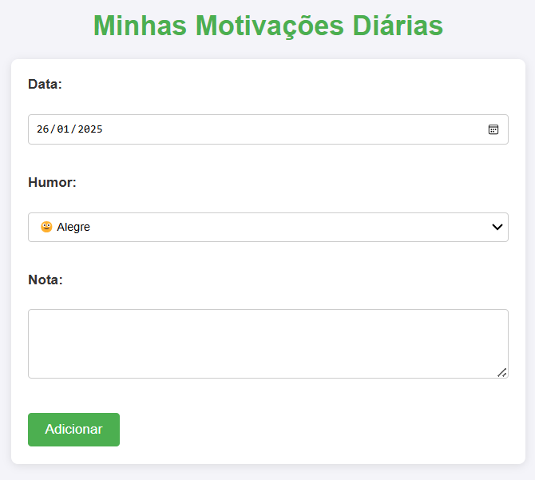
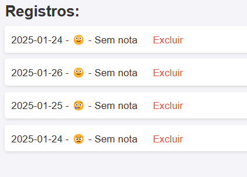

# Projeto Nome

System developed to monitor patients in psychology clinics. The app aims to record patients' daily emotions.
## Demonstração

### Tela Principal


### Outra Tela


## Como Usar

1. Clone o repositório:
   ```bash
   git clone https://github.com/usuario/repositorio.git
   ```
2. Acesse o diretório do projeto:
   ```bash
   cd repositorio
   ```
3. Siga as instruções para instalar as dependências e rodar o projeto.

## Tecnologias Utilizadas

- python
- Flask
- Sql

## Licença

Este projeto está licenciado sob a licença [MIT](LICENSE).

---

Se você gostou deste projeto, não esqueça de dar uma estrela! ⭐
